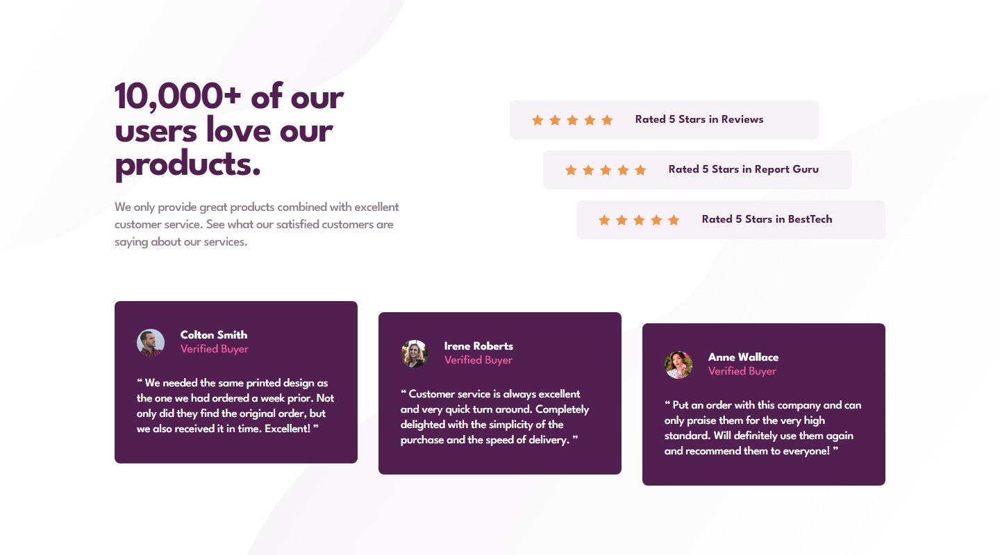
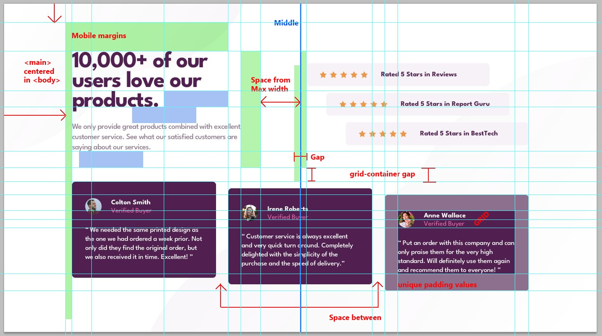
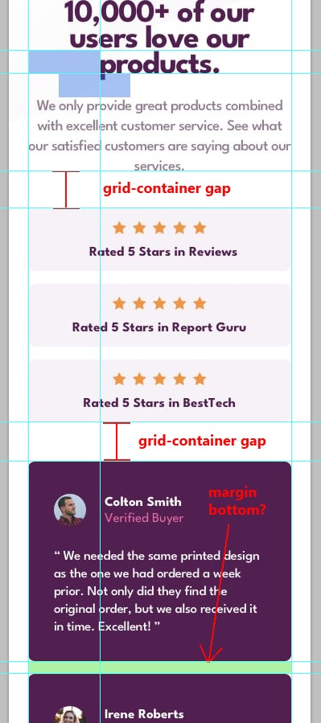

# Frontend Mentor - Social proof section solution

A solution provide by jefflangtech [Social proof section challenge on Frontend Mentor](https://www.frontendmentor.io/challenges/social-proof-section-6e0qTv_bA).

## Table of contents

- [Overview](#overview)
  - [The challenge](#the-challenge)
  - [Screenshot](#screenshot)
  - [Links](#links)
- [My process](#my-process)
  - [Built with](#built-with)
  - [Step by step](#step-by-step)
  - [Continued development](#continued-development)
- [Author](#author)


## Overview

### The challenge

Users should be able to:

- View the optimal layout depending on their device's screen size
- See hover states for interactive elements

### Screenshot



### Links

- Solution URL: []()
- Live Site URL: [https://jefflangtech.github.io/social-proof-section/](https://jefflangtech.github.io/social-proof-section/)

## My process

### Built with

- Semantic HTML5 markup
- CSS custom properties
- Flexbox
- CSS Grid

### Step by step

This will present a nice challenge working off of a static image design because the figma file is pretty broken. I'm guessing these are the types of things that can happen in the real world so here we go!

----

Total time: 7:46

1. Initial setup (0:26)
2. Project plan (0:49)
3. Layout notes (1:07)
4. Setup design system (0:33)
5. HTML structure and preliminary validation tests (0:24)
6. Style desktop layout (2:10)
7. Style mobile layout & media queries (1:52)
8. Final updates & readme (0:25)

**Notes**
This is the 2nd go around with the photoshop markup plus google doc notes. The notes are really great because I can make marks on the visual image, but then plan in the google doc the specifics of how I want to implement something. That, along the the excel sheet where I keep all my fonts, calculate rems and ems, keeps me quite organized. I have not had to stop and wonder where I was at with the implementation, or worry about forgetting how I planned to code something on the page.




I used grid and flexbox a LOT, even on small containers with only a few elements. For some reason I have always felt like those were supposed to be used with "large" things--the big container that had a big impact across the page--and not on something so simple as a user image and their name. That appears to be an error in my thinking as it became so simple to implement those little elements that needed some specific visual arrangements that otherwise would have been difficult to get perfect.

I enjoyed pulling off this utility class that created a staggered look, in both column and row layouts:

``` CSS
.stagger-children > *:nth-child(1) {
  align-self: start;
}
.stagger-children > *:nth-child(2) {
  align-self: center;
}
.stagger-children > *:nth-child(3) {
  align-self: end;
}
```

### Continued development

First time trying a flexbox on the body to center the main component...and I don't know how that went. A couple of weird moments where I couldn't get things to center right when shifting down to mobile view, then the width rule on the main element would do weird things to the layout, so I'll probably need some more practice with that, and some digging into educational resources as well. The initial setup was great, though, so there's more to it.

## Author

- Website - [JeffLangTech](https://jefflangtech.github.io/)
- Frontend Mentor - [@jefflangtech](https://www.frontendmentor.io/profile/jefflangtech)